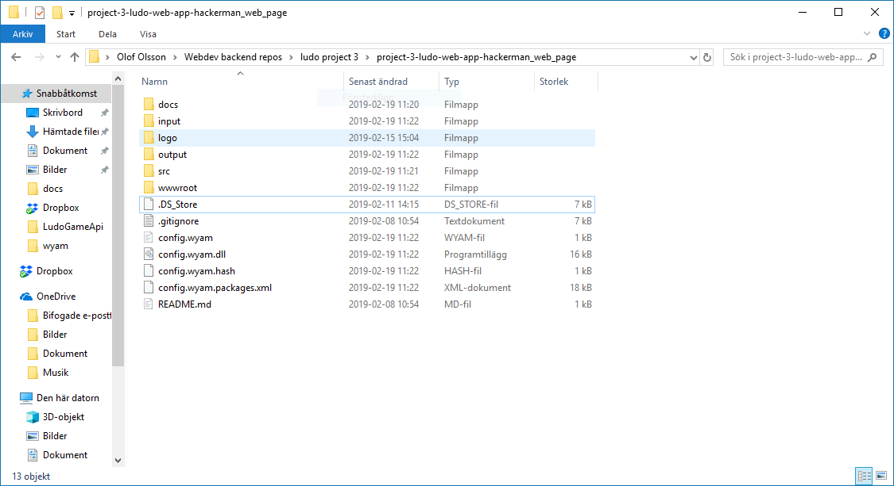
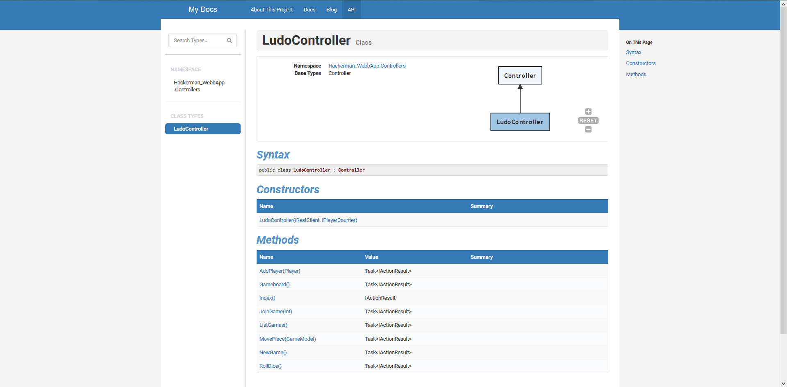
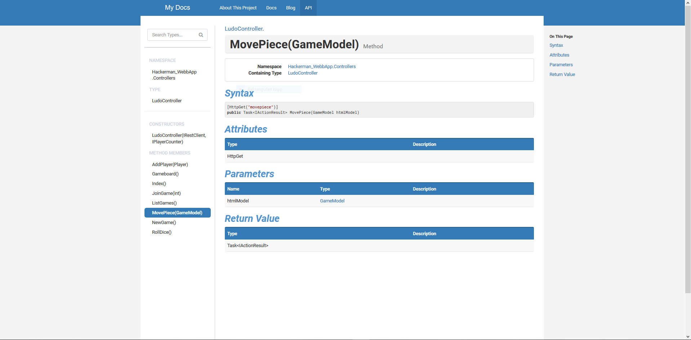

# Autodoc

We tryed to get Wyam to generate autodocs for us. We managed to get it to work, but not in the right place. This gave us alot of files in the wrong folders. See screenshot below:

This is the output that the wyam is generating for us. We ended up not using it because all the files in the wrong place.

