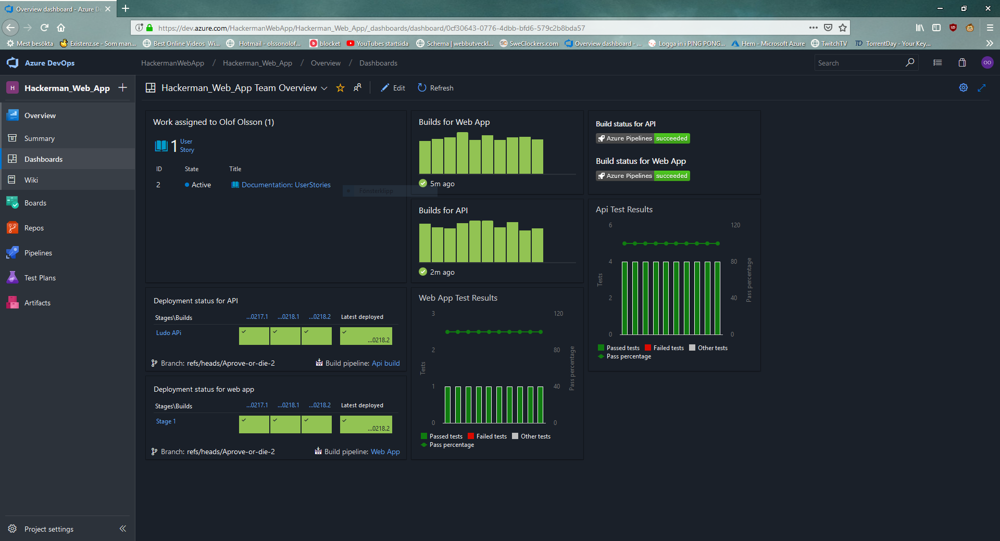
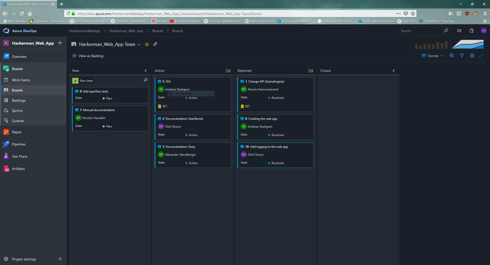
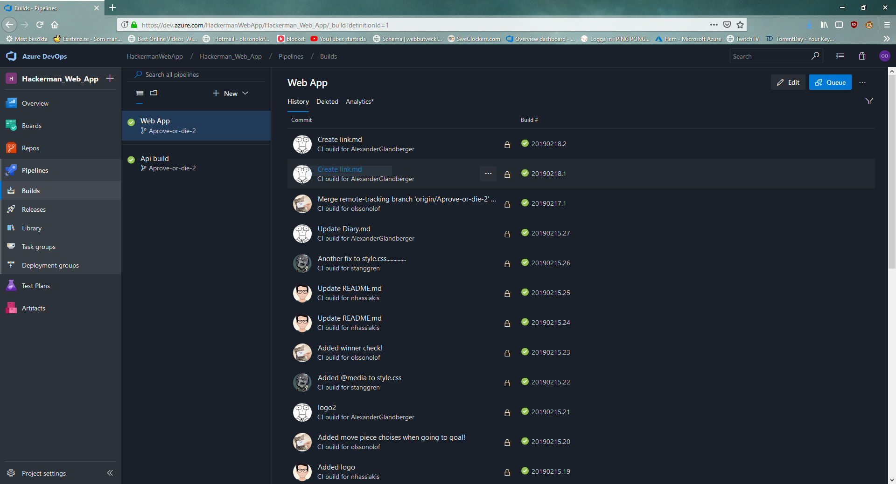

# Azure Devops documentation

We have used Azure Devops for both CI/CD.

We have our own build pipeline for the Api and another one for the web app. It's the same with the release pipelines.

We use Azures cloud services to host both the Api and the web app online.

