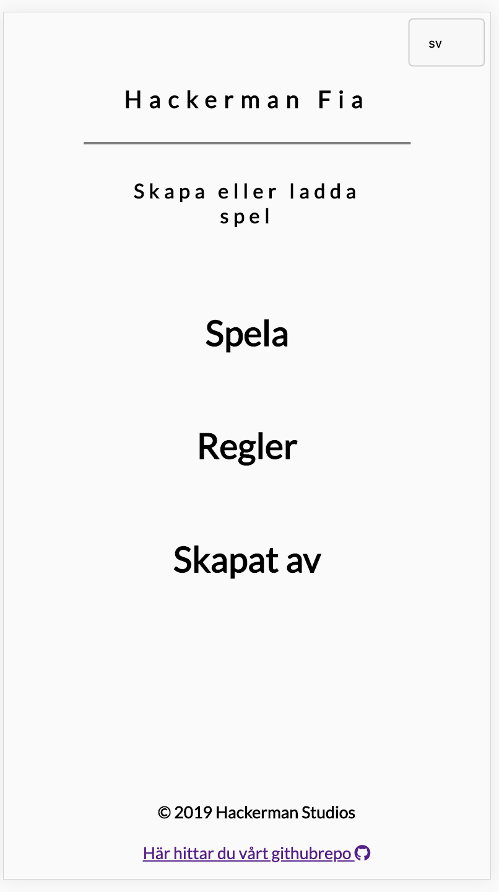
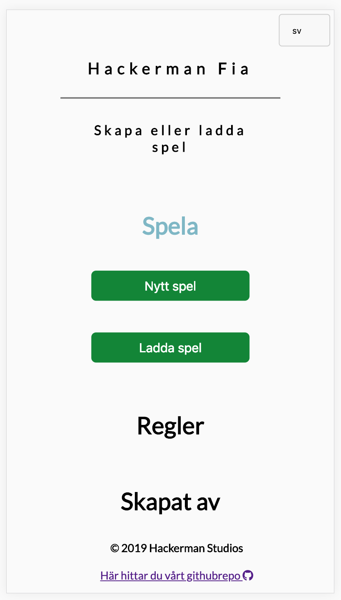
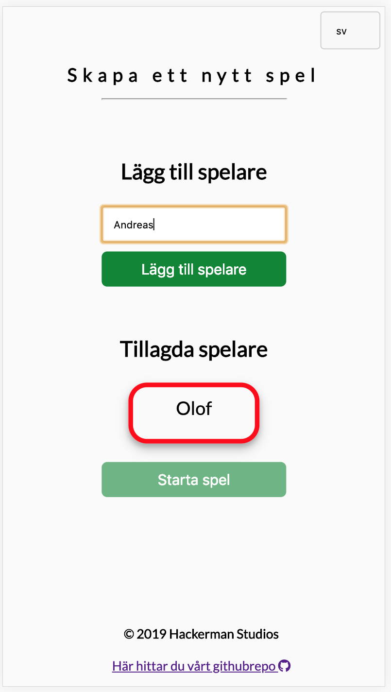

# Documentation

## Responsive page

By using media queries in the CSS the app is now responsive and has a dynamic style for phone devices. The media queries are set to a `max-width` of 600px wich extends to most phone devices.
Positions of interactive elements such as buttons are lined up in a user-friendly way and font-sizes are enlraged to be more readable.
Elements are responsive to horizontally aligned elements. These elements can also have dropdown content. This means a lack of whitespace wich is a concious decision. Due to elements with responsive position we where able to fit all necessary content without needing the user to scroll down or up on their phone device. 

